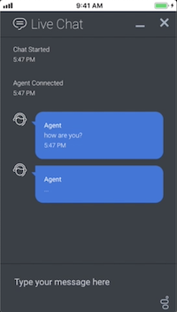

# Genesys Mobile ACD Chat examples

This repo contains Android and iOS examples for embedding the Genesys Widgets ACD chat into native applications. Right now this is the best way for Genesys customers to integrate PureCloud ACD chat into their native applications to allow their customers to initiate chats with agents. Demonstation videos can be found and downloaded from the `media` folder. 

## Prerequisites

Both examples assume that an appropriate Genesys Widgets chat widget (version 2.0) has been created in your PureCloud organization and that a contact center queue has been configured for chats to be targeted to. For more information about creating a widget, see [this document](https://help.mypurecloud.com/articles/create-a-widget-for-web-chat/) and select "Version 2". For more information about adding a Version 2.0 Genesys Widget to your web site, see [this document](https://developer.mypurecloud.com/api/webchat/widget-version2.html). For more information about creating and configuring a queue, see [this document](https://help.mypurecloud.com/articles/create-queues/).

## Using the examples

The following sections describe how to use the examples given.

### iOS example



The iOS example is a simple proof-of-concept at this point that can be extracted and used with some changes by customers. The example can be run as-is with a few simple modifications in the `webchatv2demo.html` file.

* Modify the `deploymentKey` field in the javascript to be the deployment key as configured in your PureCloud org in the admin section under "Contact Center => Widgets".
* Modify the `orgGuid` field in the javascript to be the org id of the organization, found in the PureCloud admin section under "Account Settings => Organization Settings => Advanced".
* Modify the `targetAddress` field in the javascript to be the queue name that interactions should be sent to, configured in the PureCloud admin section under "Contact Center => Queues".

The app should then allow a chat interaction to be initiated to the specified queue.

### Android example


The Android example application provides a library project can be extracted and built into an existing customer's native app as-is (with a configuration file) under the `genesyswidgetsacdchat` folder. 

* Copy the library project into the existing project by copying the entirety of `genesyswidgetsacdchat` into the existing project's root directory.
* Add the library project into the `settings.gradle` of the base project (e.g. `include ':existing-app', ':genesyswidgetsacdchat'`)
* Add the library project as a dependency to the existing app by modifying the `dependencies` section of the existing app's `build.gradle` file and adding `implementation project(":genesyswidgetsacdchat")`.
* Rename the file `genesyswidgetsacdchat/genesys.example.properties` to `genesyswidgetsacdchat/genesys.properties`.
* Modify the fields in the `genesys.properties` fields to be the deployment key, orgGuid, and queue name as described above.
* From the existing app, whereever you'd like to initiate a chat with an agent, simply call the following static function providing a valid `Activity` reference:

```
            GenesysAcdChatActivity.launchChat(
                activity,                   // the activity from which to launch the chat
                2,                          // the priority of the chat 
                "Jimmy",                    // the first name of the customer
                "Chat",                     // the last name of the customer
                "jimmy.chat@chat.com")      // the email address of the customer
```